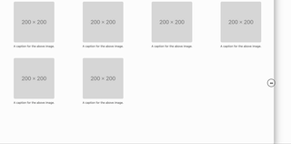

# Bootstrap Grid

Partendo dalla [pagina introduttiva di Bootstrap](https://getbootstrap.com/docs/5.3/getting-started/introduction/) seguire le istruzioni su come inserire i CSS e JS di Bootstrap.

Vogliamo realizzare una pagina _responsive_ che visualizzi una griglia di immagini. Essendo _responsive_, la griglia si adatterà alla dimensione dello schermo, come si vede nell'immagine qui sotto:

Per comprendere il funzionamento delle griglie in Bootstrap, vedere i seguenti link:

* https://getbootstrap.com/docs/5.3/layout/grid/
* https://www.w3schools.com/bootstrap/bootstrap_grid_system.asp
* https://www.youtube.com/watch?v=-jnCgrR_yKg

Si può ottenere il _template_ della figura leggendo da https://getbootstrap.com/docs/5.3/content/figures/.

Per ottenere dei _placeholder_ di immagini di qualsiasi dimensione, si può utilizzare il sito https://placehold.co
