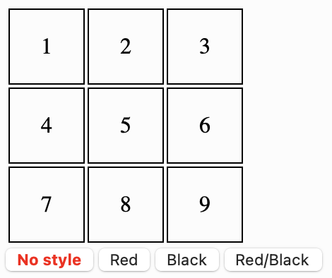
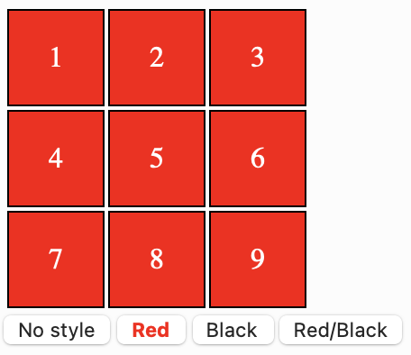
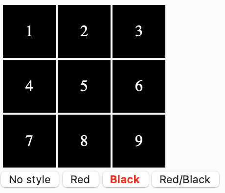
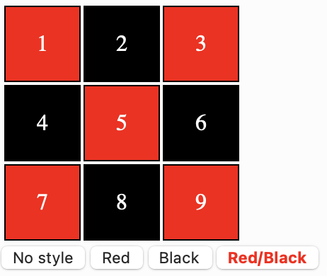

# Esercizio 1

Creare una tabella come nella figura 1 con quattro pulsanti:

Ogni cella della tabella deve avere dei bordi neri di 1px. Ogni cella è alta 50px e larga 50px.

Creiamo una classe `btnSelected` per evidenziare di rosso e con stile in grassetto il pulsante selezionato. Impostiamo la classe sul primo pulsante.

Quando si clicca sul pulsante `Red`, la tabella cambia così:

Per fare ciò:

* creiamo una nuova classe `Red` che abbia colore di sfondo rosso e colore del testo bianco
* creiamo una funzione `Red` in JavaScript che selezioni tutti gli elementi `td`, rimuova eventuali altre classi ed aggiunga la classe `Red`.
* rimuoviamo la classe `btnSelected` da tutti i bottoni tranne il bottone `Red`.

Quando si clicca sul bottone `Black`, la tabella cambia così:

Per fare ciò:

* creiamo una nuova classe `black` che abbia colore di sfondo nero e colore del testo bianco
* creiamo una funzione `black` in JavaScript che selezioni tutti gli elementi `td`, rimuova eventuali altre classi ed aggiunga la classe `black`.
* rimuoviamo la classe `btnSelected` da tutti i bottoni tranne il bottone `Black`.

Quando si clicca sul bottone `Red/Black`, la tabella cambia così:

In questo caso l'idea è quella di vedere il contenuto della cella (`innerHTML`) e controllare se ha un numero pari o dispari.

Quando infine si clicca sul pulsate `No style`, la tabella cambia ritorna al suo stile iniziale.