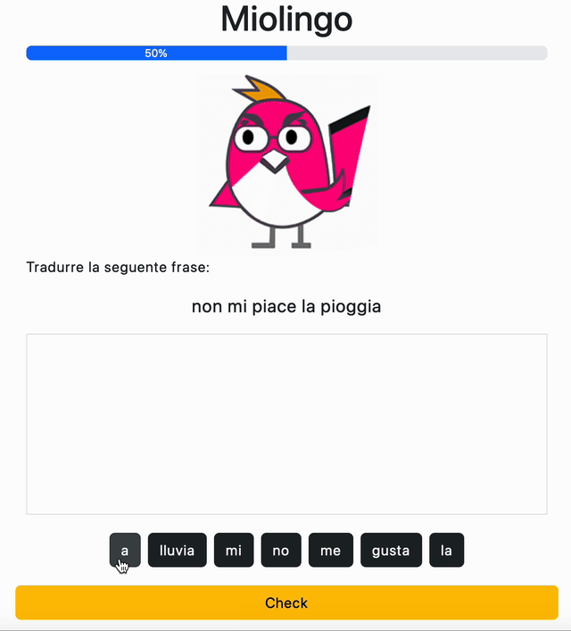

# Miolingo

Vogliamo realizzare la nostra versione privata di [Duolingo](https://www.duolingo.com/).

Il risultato sarà circa questo:

Viene già fornito un file con dieci coppie di frasi italiano/spagnolo.

Quindi:

* aggiungere CSS e JS [Bootstrap](https://getbootstrap.com/docs/5.3/getting-started/introduction/)
* qua il link alla [progress bar](https://getbootstrap.com/docs/5.3/components/progress/)
* qua il link ai [bottoni](https://getbootstrap.com/docs/5.3/components/buttons/)