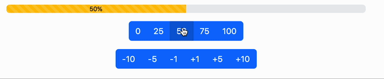

# Progress bar

## HTML e CSS

* linkare il CSS di [Bootstrap](https://getbootstrap.com/docs/5.3/getting-started/introduction/)
* inserire una [progress bar](https://getbootstrap.com/docs/5.3/components/progress/)
* inserire dei [bottoni](https://getbootstrap.com/docs/5.3/components/button-group/)

## JS

Ottenere l'effetto come in figura:

Il colore della barra sarà:

* rosso se >= 0 e <= 25
* arancione se > 25 e <= 50
* ciano se > 50 e <= 75
* verde se > 75 e <= 100

**La barra non può scendere sotto lo 0 o sopra il 100!**