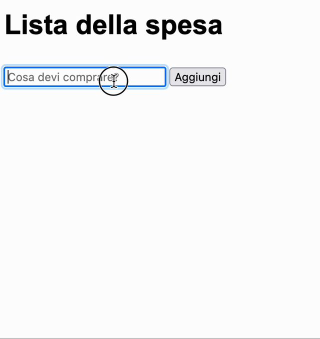
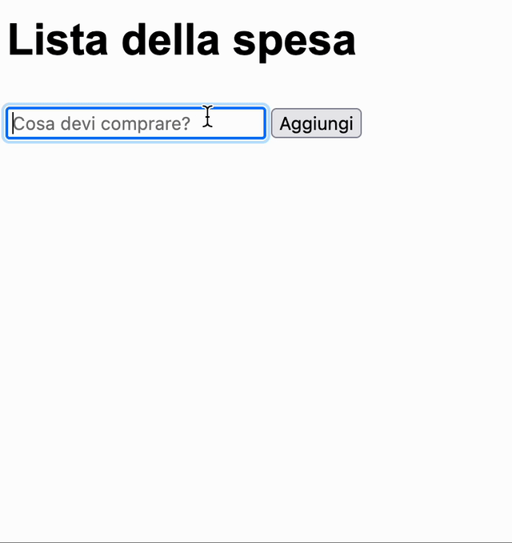

# Shopping list

Vogliamo ottenere una pagina web dinamica che si comporti in questo modo:

## Istruzioni

Gli elementi che ci servono sono:

* [H1](https://www.w3schools.com/tags/tag_hn.asp)
* [Input text](https://www.w3schools.com/tags/tag_input.asp)
* [Button](https://www.w3schools.com/tags/tag_button.asp)
* [UL e LI](https://www.w3schools.com/tags/tag_ul.asp)

L'idea è di creare un UL vuoto ma con un id, in modo da poterlo riprendere via JS.

Dopodiché, per inserire dei figli, dobbiamo usare i seguenti metodi:

* [createElement](https://www.w3schools.com/jsref/met_document_createelement.asp)
* [appendChild](https://www.w3schools.com/jsref/met_node_appendchild.asp)

# Versione 2

In questo caso, dobbiamo aggiungere gli eventi `click` e di `dblclick` via JS, quando creiamo gli elementi da aggiungere:

* [addEventListener](https://www.w3schools.com/JSREF/met_element_addeventlistener.asp)

Per rimuovere un figlio, dobbiamo usare il metodo:

* [removeChild](https://www.w3schools.com/jsref/met_node_removechild.asp)