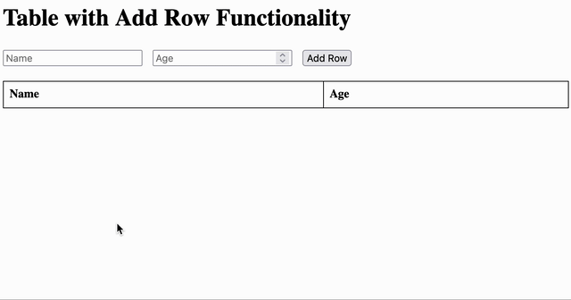

# Table and JS (Pure JS)

Vogliamo realizzare un sito tipo questo:

Ricordiamo i comandi più importanti che abbiamo già visto:

* [getElementById](https://www.w3schools.com/jsref/met_document_getelementbyid.asp)
* [getElementsByTagName](https://www.w3schools.com/jsref/met_document_getelementsbytagname.asp)
* [getElementsByClassName](https://www.w3schools.com/jsref/met_document_getelementsbyclassname.asp)
* [appendChild](https://www.w3schools.com/jsref/met_node_appendchild.asp)
* [innerHtml](https://www.w3schools.com/jsref/prop_html_innerhtml.asp)
* [eventi](https://www.w3schools.com/js/js_htmldom_events.asp)