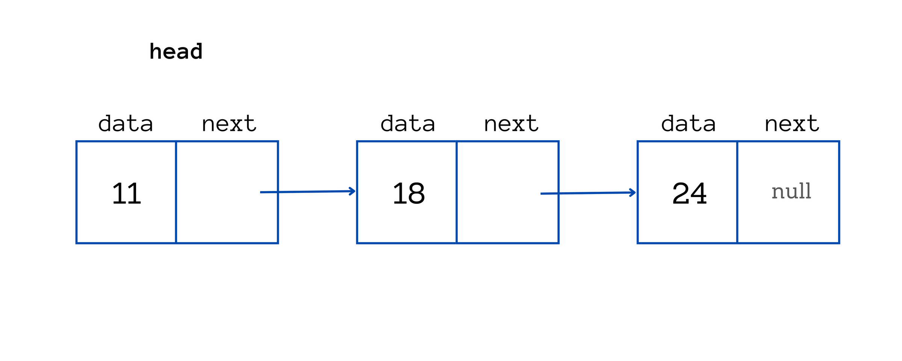
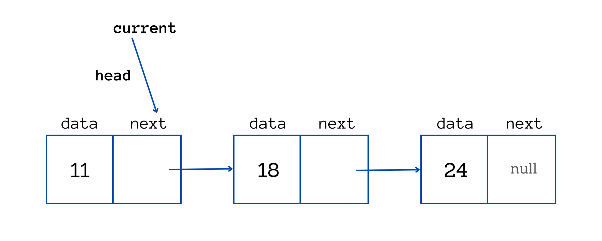
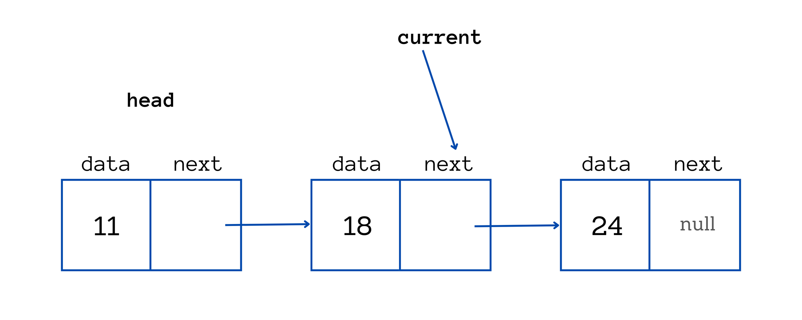
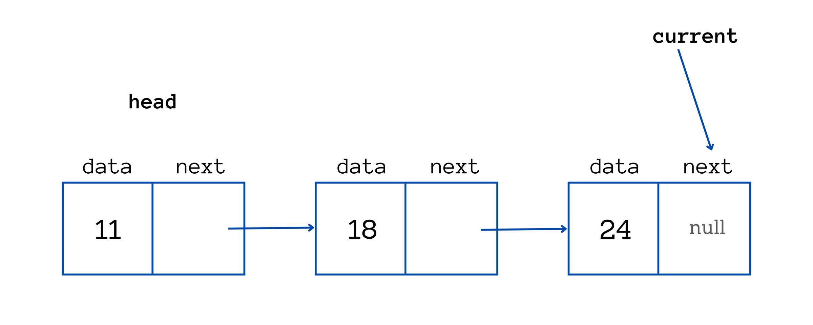

# IntLinkedList

Immaginiamo di avere una struttura di questo tipo:

```Java
public class Node {
  public int data;
  public Node next;

  public Node(int data, Node next) {
    this.data = data;
    this.next = next;
  }

  public Node(int data) {
    this(data, null);
  }
}
```

Questa è chiaramente una struttura ricorsiva, che contiene al suo interno una istanza della stessa classe.

Ad esempio la possiamo usare in questo modo:

```Java
public static void main(String[] args) {
  Node head = new Node(11);
  head.next = new Node(18);
  head.next.next = new Node(24);
}
```

e otteniamo in memoria una struttura di questo tipo:



Per scorrere questa lista possiamo creare un puntatore alla testa e scorrerlo fino a che non troviamo null:





con un codice del tipo:

```Java
Node current = head;
while (current != null) {
  System.out.print(current.data + " ");
  current = current.next;
}
System.out.println();
```

che darà output:

```
11 18 24 
```

Questo tipo di struttura non è facile da utilizzare, per cui noi vogliamo nasconderne la complessità in una classe `IntLinkedList` e esporre solo dei metodi simili a quelli dell'esercizio `InfiniteIntArray`. Notiamo che la stessa classe `Node` è privata e quindi nascosta.

Per informazioni extra, consultare https://www.freecodecamp.org/news/how-linked-lists-work/