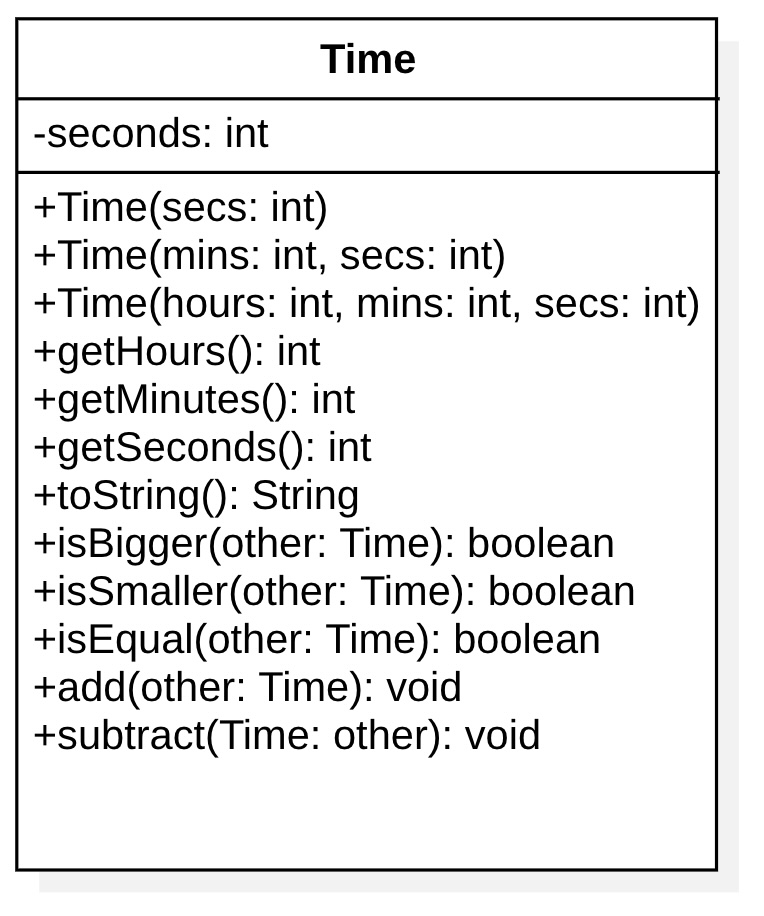

# Time

Definire una classe `Time` che permetta di definire un periodo temporale di ore, minuti e secondi.

In verità la classe terrà il tempo in secondi, anche se permetterà di convertire il valore in ore/minuti/secondi.

* `getHours()`:
* `getMinutes()`:restituisce il numero totale di ore/minuti/secondi.
* `getSeconds()`: restituisce il numero totale di ore/minuti/secondi. Ad esempio, partendo da `3:04:01`, `getHours()` restituirà 3, `getMinutes()` restituirà 184 e `getSeconds()` restituirà 11041.
* toString(): restituisce una stringa in formato `3:04:01`.

Se uno inserisce valori negativi, verrà lanciata un'eccezione.
Se subtract dà un risultato negativo, verrà lanciata un'eccezione.