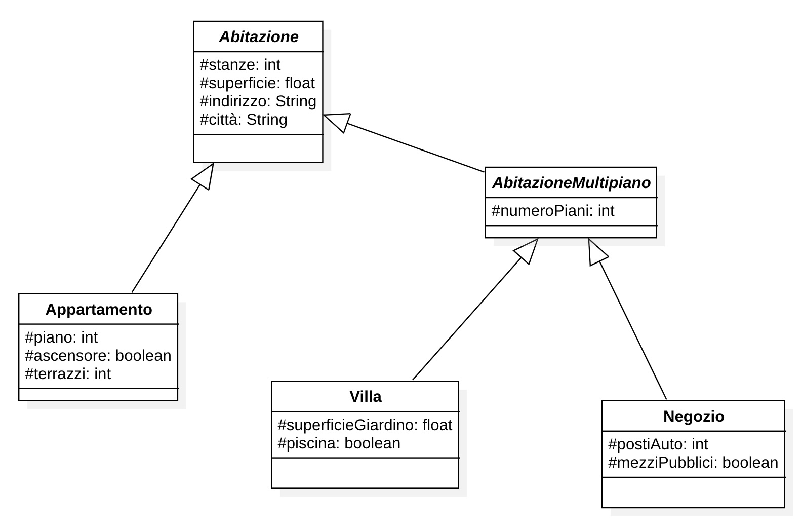

# Abitazioni

Si intende realizzare una gerarchia di classi per rappresentare e gestire un patrimonio immobiliare composto da abitazioni, ville, appartamenti e negozi.

Le caratteristiche di un'**abitazione** da impostare in fase di inizializzazione sono il numero di stanze, la superficie, l'indirizzo e la citta.

Le **ville** sono caratterizzate inoltre dal numero di piani, dalla superficie del giardino e dal fatto di avere o meno la piscina.

Un **appartamento** è caratterizzato dal piano a cui è situato, dal fatto che sia raggiungibile o meno tramite ascensore e dal numero dei terrazzi.

Un **negozio** è caratterizzato dal numero di piani di cui è costituito, dal numero di posti auto disponibili per i clienti e dalla raggiungibilità o meno tramite mezzi pubblici.

Definire mediante un diagramma UML le classi che realizzano la gerarchia descritta valutando l'opportunità di utilizzare una o più classi astratte. Implementare in linguaggio Java le classi progettate specificando costruttori e metodi di accesso agli attributi e sovrascrivendo opportunamente i metodi `toString` ed `equals`. 

Codificare una classe `Main` di test il cui metodo main istanzi oggetti corrispondenti alle varie tipologie di abitazioni e invochi ciascuno dei metodi definiti almeno una volta.

Creare un array di `Abitazione` in cui inserire tutte le istanze e stampare l'array con un ciclo.

**Prendere spunto dagli esempi**:
* https://replit.com/@pcantare/ExInhPol1
* https://replit.com/@pcantare/ExInhPol2