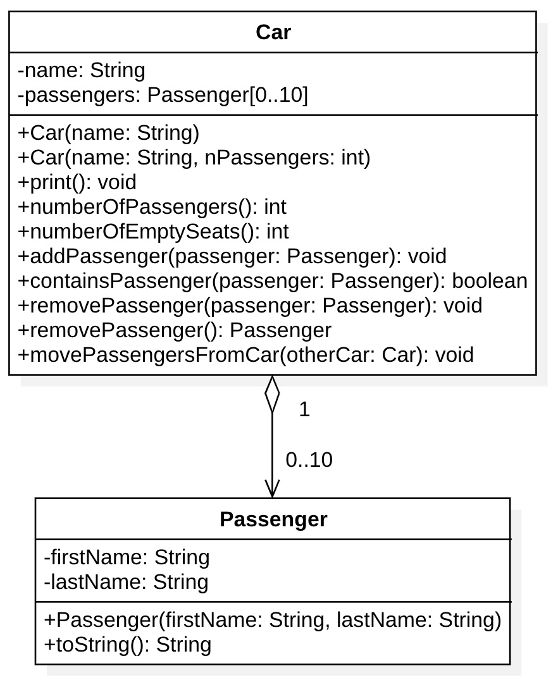

# Car

Vogliamo creare una classe `Car` che ci permetta di far salire e scendere dei passeggeri. La macchina conterrà un array di `Passenger`, classe che a sua volta rappresenterà un passeggero con nome e cognome.



La classe avrà due costruttori:

* `Car(String nome)`: costruttore che creerà di default un array di 5 celle.
* `Car(String nome, int nPassengers)`: costruttore che prenderà il numero di passeggeri della macchina.

Nel caso qualcuno cerchi di costruire una macchina con un numero di passeggeri minore di 1 o maggiore di 10 lanceremo un'eccezione:

```Java
if (...) {
  throw new RuntimeException("Messaggio di errore");
}
```

Servirà un metodo `void print()` per stampare la macchina. Questo metodo stamperà il nome della macchina, i posti totali e l'elenco dei passeggeri, tutto su una riga, come ad esempio:

```
Lancia Y (5 posti): Martin Scorsese, Robert De Niro, Jennifer Lawrence
```

La macchina ci permetterà di sapere sempre quante persone ci sono a bordo e quanti posti liberi ci sono:

* `int numberOfPassengers()`
* `int numberOfEmptySeats()`

Per verificare se una cella di un array è libera si può verificare se è `null` oppure no:

```Java
if (array[0] == null) {
  System.out.println("La cella 0 è vuota");
} else {
  System.out.println("La cella 0 non è vuota");
}
```

Ci permetterà inoltre di far salire un passeggero, vedere se un certo passeggero è presente, far scendere un passeggero qualsiasi o uno specifico passeggero:

* `void addPassenger(Passenger passenger)`: nel caso si tenti di far salire un passeggero in una macchina già piena, verrà lanciata un'eccezione.
* `boolean containsPassenger(Passenger passenger)`: restituisce `true` se il passeggero è presente e `false` altrimenti.
* `void removePassenger(Passenger passenger)`: rimuove uno specifico passeggero. Se il passeggero non è presente, viene lanciata un'eccezione.
* `Passenger removePassenger()`: rimuove un passeggero qualsiasi e lo restituisce. Se nessun passeggero è presente, viene lanciata un'eccezione.

Ci sarà infine un ultimo metodo che prende un'altra macchina e sposta più passeggeri possibile da quella a questa macchina.

* `void movePassengersFromCar(Car otherCar)`