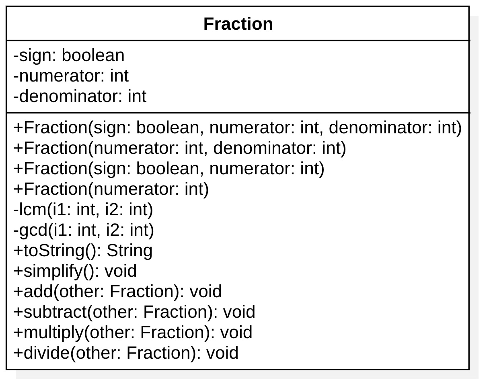

# Fraction

Scriviamo una classe che rappresenti una frazione. Viene già fornito lo schema UML

La frazione sarà rappresentata tenendo il suo segno (`true` per positivo, `false` per negativo), il numeratore e il denominatore, **che saranno sempre e solo positivi**. Il costruttore aggiusterà i parametri di input affinché ciò accada, come nei casi seguenti:

* new Fraction(false, -1, 5): imposterà i valori a true, 1, 5 (due negativi -> positivo)
* new Fraction(true, -1, -5): imposterà i valori a true, 1, 5 (due negativi -> positivo)
* new Fraction(false, -1, -5): imposterà i valori a false, 1, 5 (tre negativi -> negativo)

Alcune note su alcuni metodi:

* lcm (least common multiplier = minimo comune multiplo): metodo già fornito
* gcd (greatest common divisor = massimo comun divisore): metodo già fornito
* simplify: riduce la frazione ai minimi termini, cioè ad esempio 10/8 diventerà 5/4
* toString: la frazione sarà stampata come "3/4" se è positiva, "-2/3" se è negativa, "5" se il denominatore è 1