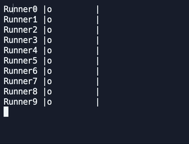
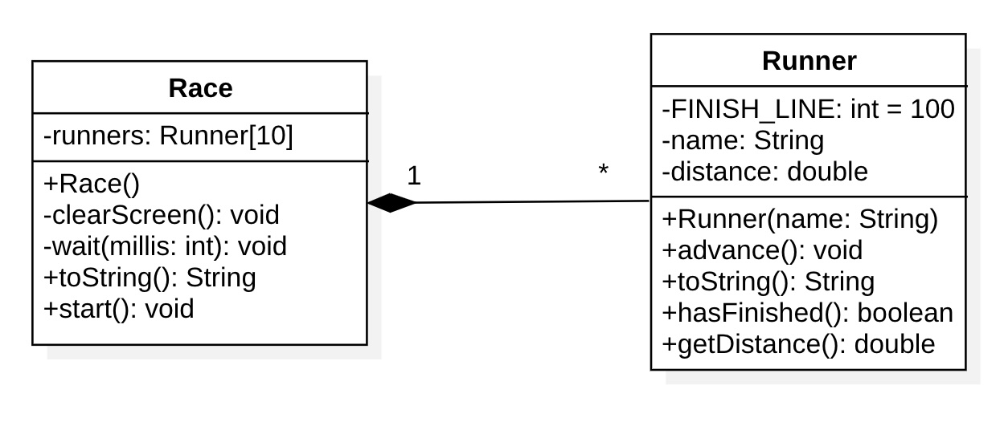

# Runners

Vogliamo realizzare una simulazione di una corsa. Ci servirà una classe `Runner` che simula un corridore e una classe `Race` che simulerà la corsa.



La corsa ha lunghezza 100 metri (c'è una costante `FINISH_LINE` in `Runner`) e ad ogni giro il corridore si sposterà di un numero compreso tra 0 e 10 metri.

Viene già fornito la struttura delle classi e il `main`.



Il metodo `advance` della classe `Runner` fa avanzare il corridore di una distanza `double` compresa tra 0 e 10 metri.

Il metodo `toString` della classe `Runner` deve stampare un corridore in questo formato:

```
Runner0 |     o    |
```

basandosi sul nome e sulla distanza percorsa, mentre il metodo `toString` della classe `Race` stamperà tutti i corridori.

Il metodo `hasFinished` della classe `Runner` restituisce `true` se il corridore ha raggiunto distanza 100, `false` altrimenti.

Il metodo `start` della classe `Race` gestisce tutta la corsa. Fa avanzare i corridori, cancella lo schermo, stampa i corridori, attende un secondo con il metodo `wait` e controlla se qualcuno ha vinto.