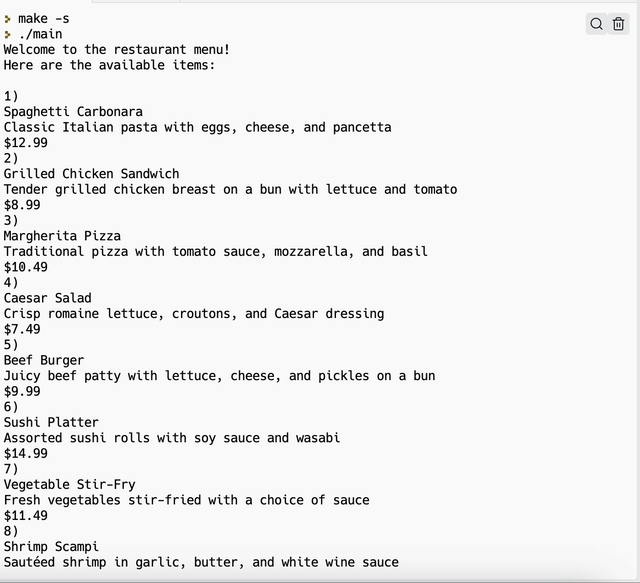

# Restaurant menu

Realizzare un menu di un ristorante. Il file `files/menu_items.txt` contiene una lista di piatti di un ristorante come nell'esempio qui sotto:

* creare una struttura che rappresenti un `MenuItem`.
* creare un array di `MenuItem` che tenga tutti i piatti possibili del ristorante.
* creare un secondo array di `MenuItem` che tenga i piatti scelti dal cliente.

Implementare le funzioni nel file `main.c`.